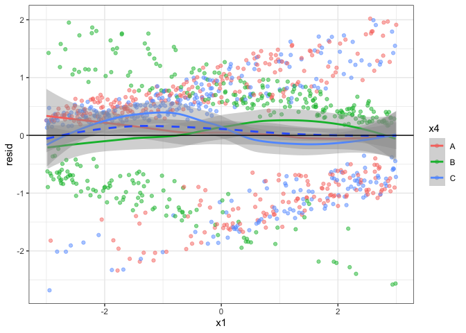
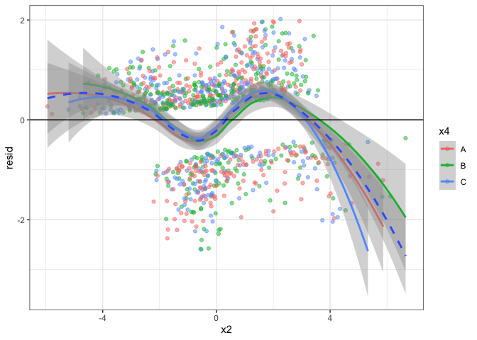

# Week Ten


## Last Week

- Probability Distributions for Count Data

- Count Regression

- Exams (Last - Last Week)

## This Week: Generalized Linear Models for Count Data

Today:

- Take Home Exam Recap

- Activity:

  - Model exploration for count data

- Thursday: Lab

## Next Week: Multicategory Regression

------------------------------------------------------------------------



### Part II of Exam

The second part of the exam will involve model fitting with logistic
regression. Use the `midterm_data` and note that y is a single binary
variable.

``` r
set.seed(10062025)
n <- 1000
x1 <- seq(-3, 3, length.out = n)
x2 <- rnorm(n, sd = 2)
x3 <- rnorm(n)
x4 <- sample(c('A','B','C'), size = n, replace = T)

dat_tibble <- tibble(x1, x2, x3, x4)
X_mat <- model.matrix(~ x1 + x2 + I(x2^2) + I(x2 ^3) + x3 + x4 + x1:x4)

beta0 <- 0
beta1 <- -1
beta2 <- 1
beta2_sq <- .6
beta2_cube <- -.3
beta3 <- 0
beta4b <- 0
beta4c <- 0
beta1_4b <- 2
beta1_4c <- 0

beta_vec <- c(beta0, beta1, beta2, beta2_sq, beta2_cube, beta3, beta4b, beta4c, beta1_4b, beta1_4c)

pi <- invlogit(X_mat %*% beta_vec)

y <- rbinom(n, 1, pi)
midterm_data <- tibble(y = y, x1, x2, x3, x4)
```

#### 4. (4 points) Create a set of EDA figures to explore the relationship between the response (success out of 1 trial) and the potential covariates.


#### 5. (4 points) Summarize your findings in the figures

Which variables and combinations of variables to you think are
important?

- $x_1$ tends to have a decreasing relationship with the success
  probability; however, the relationship is increasing for group B in
  $x_4$

- $x_2$ appears to have a non-linear relationship with the success
  probability but is relatively consistent across groups of $x_4$

- $x_3$ might have a weak relationship with success probability -
  potentially quadratic although there is a lot of uncertainty in model
  fits in the tails of $x_3$.

- $x_4$ doesn’t seem to be particularly meaningful alone

#### 6. (4 points) Using residual diagnostics and AIC fit a series of models.

You don’t need to print out all of these results, but include a written
summary of models you explored. You are welcome to use bullet points for
this section.

##### Start Model

``` r
start_model <- glm(y ~ x1 + x2 + x3 + x4, data = midterm_data, family = binomial)
summary(start_model)
```


    Call:
    glm(formula = y ~ x1 + x2 + x3 + x4, family = binomial, data = midterm_data)

    Coefficients:
                Estimate Std. Error z value Pr(>|z|)    
    (Intercept)  0.64185    0.11670   5.500 3.80e-08 ***
    x1          -0.18287    0.04044  -4.522 6.14e-06 ***
    x2          -0.28608    0.03728  -7.675 1.66e-14 ***
    x3           0.08628    0.06871   1.256    0.209    
    x4B         -0.01664    0.16775  -0.099    0.921    
    x4C          0.16761    0.17027   0.984    0.325    
    ---
    Signif. codes:  0 '***' 0.001 '**' 0.01 '*' 0.05 '.' 0.1 ' ' 1

    (Dispersion parameter for binomial family taken to be 1)

        Null deviance: 1296.1  on 999  degrees of freedom
    Residual deviance: 1207.4  on 994  degrees of freedom
    AIC: 1219.4

    Number of Fisher Scoring iterations: 4

##### X1

``` r
fit_data <- tibble(x1 = midterm_data$x1, 
                   y = midterm_data$y, 
                   x4 = midterm_data$x4,
                   prop = invlogit(coef(start_model)[[1]] + coef(start_model)[[2]] * x1))

midterm_data |>
  mutate(prop = y )|>
  ggplot(aes(y = prop, x = x1, color = x4)) +
  geom_smooth(method = 'loess', formula = 'y ~ x') +
  geom_jitter(alpha = .5, height = .03, width = .03) +
  theme_bw() +
  geom_line(data = fit_data, color = 'black')
```


``` r
tibble(x1 = midterm_data$x1, 
       resid =rstandard(start_model),
       x4 = midterm_data$x4) |>
  ggplot(aes(y = resid, x = x1, color = x4)) +
  geom_jitter(alpha = .5) +
  geom_smooth(method = 'loess', formula = 'y ~ x') +
  geom_smooth(method = 'loess', formula = 'y ~ x', inherit.aes = F, aes(y=resid, x = x1), linetype = 2) + 
  theme_bw() +
  geom_hline(yintercept = 0)
```


##### X2

``` r
fit_data <- tibble(x2 = midterm_data$x2, 
                   y = midterm_data$y, 
                   x4 = midterm_data$x4,
                   prop = invlogit(coef(start_model)[[1]] + coef(start_model)[[3]] * x2))

midterm_data |>
  mutate(prop = y )|>
  ggplot(aes(y = prop, x = x2, color = x4)) +
  geom_smooth(method = 'loess', formula = 'y ~ x') +
  geom_jitter(alpha = .5, height = .03, width = .03) +
  theme_bw() +
  geom_line(data = fit_data, color = 'black')
```


``` r
tibble(x2 = midterm_data$x2, 
       resid =rstandard(start_model),
       x4 = midterm_data$x4) |>
  ggplot(aes(y = resid, x = x2, color = x4)) +
  geom_jitter(alpha = .5) +
  geom_smooth(method = 'loess', formula = 'y ~ x') +
  geom_smooth(method = 'loess', formula = 'y ~ x', inherit.aes = F, aes(y=resid, x = x2), linetype = 2) + 
  theme_bw() +
  geom_hline(yintercept = 0)
```


##### X3

``` r
fit_data <- tibble(x3 = midterm_data$x2, 
                   y = midterm_data$y, 
                   x4 = midterm_data$x4,
                   prop = invlogit(coef(start_model)[[1]] + coef(start_model)[[3]] * x3))

midterm_data |>
  mutate(prop = y )|>
  ggplot(aes(y = prop, x = x3, color = x4)) +
  geom_smooth(method = 'loess', formula = 'y ~ x') +
  geom_jitter(alpha = .5, height = .03, width = .03) +
  theme_bw() +
  geom_line(data = fit_data, color = 'black')
```


``` r
tibble(x3 = midterm_data$x3, 
       resid =rstandard(start_model),
       x4 = midterm_data$x4) |>
  ggplot(aes(y = resid, x = x3, color = x4)) +
  geom_jitter(alpha = .5) +
  geom_smooth(method = 'loess', formula = 'y ~ x') +
  geom_smooth(method = 'loess', formula = 'y ~ x', inherit.aes = F, aes(y=resid, x = x3), linetype = 2) + 
  theme_bw() +
  geom_hline(yintercept = 0)
```


##### Model v2.0 add X1 & X4 interaction and drop X3

``` r
modelv2 <- glm(y ~ x1 + x2 + x4 + x1:x4, data = midterm_data, family = binomial)
summary(modelv2)
```


    Call:
    glm(formula = y ~ x1 + x2 + x4 + x1:x4, family = binomial, data = midterm_data)

    Coefficients:
                Estimate Std. Error z value Pr(>|z|)    
    (Intercept)  0.85486    0.13789   6.200 5.66e-10 ***
    x1          -0.67685    0.08716  -7.766 8.11e-15 ***
    x2          -0.34496    0.04306  -8.011 1.13e-15 ***
    x4B         -0.01082    0.20142  -0.054    0.957    
    x4C          0.17142    0.20550   0.834    0.404    
    x1:x4B       1.44488    0.12783  11.303  < 2e-16 ***
    x1:x4C      -0.11512    0.12946  -0.889    0.374    
    ---
    Signif. codes:  0 '***' 0.001 '**' 0.01 '*' 0.05 '.' 0.1 ' ' 1

    (Dispersion parameter for binomial family taken to be 1)

        Null deviance: 1296.1  on 999  degrees of freedom
    Residual deviance:  970.3  on 993  degrees of freedom
    AIC: 984.3

    Number of Fisher Scoring iterations: 5

##### X1

``` r
prop_all <- invlogit(model.matrix(y ~ x1 + x1:x4 ) %*% coef(modelv2)[c(1,2,6,7)])

fit_data <- tibble(x1 = midterm_data$x1, 
                   y = midterm_data$y, 
                   x4 = midterm_data$x4,
                   prop = prop_all)

midterm_data |>
  mutate(prop = y )|>
  ggplot(aes(y = prop, x = x1, color = x4)) +
  geom_smooth(method = 'loess', formula = 'y ~ x') +
  geom_jitter(alpha = .5, height = .03, width = .03) +
  theme_bw() +
  geom_line(data = fit_data, linetype = 2)
```


``` r
tibble(x1 = midterm_data$x1, 
       resid =rstandard(modelv2),
       x4 = midterm_data$x4) |>
  ggplot(aes(y = resid, x = x1, color = x4)) +
  geom_jitter(alpha = .5) +
  geom_smooth(method = 'loess', formula = 'y ~ x') +
  geom_smooth(method = 'loess', formula = 'y ~ x', inherit.aes = F, aes(y=resid, x = x1), linetype = 2) + 
  theme_bw() +
  geom_hline(yintercept = 0)
```



##### X2

``` r
fit_data <- tibble(x2 = midterm_data$x2, 
                   y = midterm_data$y, 
                   x4 = midterm_data$x4,
                   prop = invlogit(coef(modelv2)[[1]] + coef(start_model)[[3]] * x2))

midterm_data |>
  mutate(prop = y )|>
  ggplot(aes(y = prop, x = x2, color = x4)) +
  geom_smooth(method = 'loess', formula = 'y ~ x') +
  geom_jitter(alpha = .5, height = .03, width = .03) +
  theme_bw() +
  geom_line(data = fit_data, color = 'black')
```


``` r
tibble(x2 = midterm_data$x2, 
       resid =rstandard(modelv2),
       x4 = midterm_data$x4) |>
  ggplot(aes(y = resid, x = x2, color = x4)) +
  geom_jitter(alpha = .5) +
  geom_smooth(method = 'loess', formula = 'y ~ x') +
  geom_smooth(method = 'loess', formula = 'y ~ x', inherit.aes = F, aes(y=resid, x = x2), linetype = 2) + 
  theme_bw() +
  geom_hline(yintercept = 0)
```


##### Model v3.0 add square of x2 and drop x4

``` r
modelv3 <- glm(y ~ x1 + x2 + I(x2^2) + x1:x4, data = midterm_data, family = binomial)
summary(modelv3)
```


    Call:
    glm(formula = y ~ x1 + x2 + I(x2^2) + x1:x4, family = binomial, 
        data = midterm_data)

    Coefficients:
                Estimate Std. Error z value Pr(>|z|)    
    (Intercept)  0.81965    0.10160   8.067 7.19e-16 ***
    x1          -0.68663    0.08483  -8.094 5.77e-16 ***
    x2          -0.36495    0.04574  -7.980 1.47e-15 ***
    I(x2^2)      0.02518    0.01655   1.522    0.128    
    x1:x4B       1.47123    0.12705  11.580  < 2e-16 ***
    x1:x4C      -0.08169    0.12181  -0.671    0.502    
    ---
    Signif. codes:  0 '***' 0.001 '**' 0.01 '*' 0.05 '.' 0.1 ' ' 1

    (Dispersion parameter for binomial family taken to be 1)

        Null deviance: 1296.13  on 999  degrees of freedom
    Residual deviance:  968.87  on 994  degrees of freedom
    AIC: 980.87

    Number of Fisher Scoring iterations: 5

##### X1

``` r
prop_all <- invlogit(model.matrix(y ~ x1 + x1:x4 ) %*% coef(modelv3)[c(1,2,5,6)])

fit_data <- tibble(x1 = midterm_data$x1, 
                   y = midterm_data$y, 
                   x4 = midterm_data$x4,
                   prop = prop_all)

midterm_data |>
  mutate(prop = y )|>
  ggplot(aes(y = prop, x = x1, color = x4)) +
  geom_smooth(method = 'loess', formula = 'y ~ x') +
  geom_jitter(alpha = .5, height = .03, width = .03) +
  theme_bw() +
  geom_line(data = fit_data, linetype = 2)
```


``` r
tibble(x1 = midterm_data$x1, 
       resid =rstandard(modelv3),
       x4 = midterm_data$x4) |>
  ggplot(aes(y = resid, x = x1, color = x4)) +
  geom_jitter(alpha = .5) +
  geom_smooth(method = 'loess', formula = 'y ~ x') +
  geom_smooth(method = 'loess', formula = 'y ~ x', inherit.aes = F, aes(y=resid, x = x1), linetype = 2) + 
  theme_bw() +
  geom_hline(yintercept = 0)
```


##### X2

``` r
fit_data <- tibble(x2 = midterm_data$x2, 
                   x2_sq <- midterm_data$x2 ^2,
                   y = midterm_data$y, 
                   x4 = midterm_data$x4,
                   prop = invlogit(coef(modelv3)[[1]] + coef(modelv3)[[3]] * x2 + coef(modelv3)[[4]] * x2_sq))

midterm_data |>
  mutate(prop = y )|>
  ggplot(aes(y = prop, x = x2, color = x4)) +
  geom_smooth(method = 'loess', formula = 'y ~ x') +
  geom_jitter(alpha = .5, height = .03, width = .03) +
  theme_bw() +
  geom_line(data = fit_data, color = 'black')
```


``` r
tibble(x2 = midterm_data$x2, 
       resid =rstandard(modelv3),
       x4 = midterm_data$x4) |>
  ggplot(aes(y = resid, x = x2, color = x4)) +
  geom_jitter(alpha = .5) +
  geom_smooth(method = 'loess', formula = 'y ~ x') +
  geom_smooth(method = 'loess', formula = 'y ~ x', inherit.aes = F, aes(y=resid, x = x2), linetype = 2) + 
  theme_bw() +
  geom_hline(yintercept = 0)
```



##### Model v4.0 add cubic term for x2

``` r
modelv4 <- glm(y ~ x1 + x2 + I(x2^2) + I(x2^3) +  x1:x4, data = midterm_data, family = binomial)
```

    Warning: glm.fit: fitted probabilities numerically 0 or 1 occurred

``` r
summary(modelv4)
```


    Call:
    glm(formula = y ~ x1 + x2 + I(x2^2) + I(x2^3) + x1:x4, family = binomial, 
        data = midterm_data)

    Coefficients:
                Estimate Std. Error z value Pr(>|z|)    
    (Intercept)  0.17391    0.13027   1.335    0.182    
    x1          -0.92290    0.10432  -8.847  < 2e-16 ***
    x2           1.06512    0.13188   8.077 6.65e-16 ***
    I(x2^2)      0.52610    0.06547   8.035 9.33e-16 ***
    I(x2^3)     -0.28887    0.02899  -9.965  < 2e-16 ***
    x1:x4B       1.93431    0.16201  11.939  < 2e-16 ***
    x1:x4C      -0.16174    0.14861  -1.088    0.276    
    ---
    Signif. codes:  0 '***' 0.001 '**' 0.01 '*' 0.05 '.' 0.1 ' ' 1

    (Dispersion parameter for binomial family taken to be 1)

        Null deviance: 1296.13  on 999  degrees of freedom
    Residual deviance:  721.86  on 993  degrees of freedom
    AIC: 735.86

    Number of Fisher Scoring iterations: 8

##### X1

``` r
prop_all <- invlogit(model.matrix(y ~x1 +  x1:x4 , data = midterm_data) %*% coef(modelv4)[c(1,2,6,7)])

true_prop <- invlogit(model.matrix(y ~x1 +  x1:x4 , data = midterm_data) %*% c(0, -1, 2, 0))


fit_data <- tibble(x1 = midterm_data$x1, 
                   y = midterm_data$y, 
                   x4 = midterm_data$x4,
                   prop = prop_all,
                   true_prop = true_prop)

midterm_data |>
  mutate(prop = y )|>
  ggplot(aes(y = prop, x = x1, color = x4)) +
#  geom_smooth(method = 'loess', formula = 'y ~ x') +
  geom_jitter(alpha = .5, height = .03, width = .03) +
  theme_bw() +
  geom_line(data = fit_data, linetype = 2) +
  geom_line(data = fit_data, linetype = 3, linewidth = 2, inherit.aes = F,
            aes(y = true_prop, x = x1, color = x4)) 
```


``` r
tibble(x1 = midterm_data$x1, 
       resid =rstandard(modelv4),
       x4 = midterm_data$x4) |>
  ggplot(aes(y = resid, x = x1, color = x4)) +
  geom_jitter(alpha = .5) +
  geom_smooth(method = 'loess', formula = 'y ~ x') +
  geom_smooth(method = 'loess', formula = 'y ~ x', inherit.aes = F, aes(y=resid, x = x1), linetype = 2) + 
  theme_bw() +
  geom_hline(yintercept = 0)
```


##### X2

``` r
fit_data <- tibble(x2 = midterm_data$x2, 
                   x2_sq <- midterm_data$x2 ^2,
                   x2_cube <- midterm_data$x2 ^3,
                   y = midterm_data$y, 
                   x4 = midterm_data$x4,
                   prop = invlogit(coef(modelv4)[[1]] +
coef(modelv4)[[3]] * x2 + coef(modelv4)[[4]] * x2_sq + coef(modelv4)[[5]] * x2_cube))

midterm_data |>
  mutate(prop = y )|>
  ggplot(aes(y = prop, x = x2, color = x4)) +
  geom_smooth(method = 'loess', formula = 'y ~ x') +
  geom_jitter(alpha = .5, height = .03, width = .03) +
  theme_bw() +
  geom_line(data = fit_data, color = 'black')
```


``` r
tibble(x2 = midterm_data$x2, 
       resid =rstandard(modelv4),
       x4 = midterm_data$x4) |>
  ggplot(aes(y = resid, x = x2, color = x4)) +
  geom_jitter(alpha = .5) +
  geom_smooth(method = 'loess', formula = 'y ~ x') +
  geom_smooth(method = 'loess', formula = 'y ~ x', inherit.aes = F, aes(y=resid, x = x2), linetype = 2) + 
  theme_bw() +
  geom_hline(yintercept = 0)
```


Notes and thoughts:

1.  difference in profile plots vs. joint visualization

2.  Continuous interactions

``` r
library(interactions)
library(ggplot2)

# Example data
set.seed(123)
data <- data.frame(
  x = rnorm(100),
  z = rnorm(100)) |>
  mutate(  y = 5 + 2*x + 3*z + 1.5*x*z
)

# Fit a linear model with an interaction term
model <- lm(y ~ x * z, data = data)

# Plot the interaction
interact_plot(model, pred = x, modx = z, plot.points = TRUE)
```


3.  3-way interactions and higher

4.  Explanatory inference vs. predictive inference

5.  AIC (and p-values) do not guarantee the model fit is good

### Back to Count Data

Recall that a GLM has three parts: random component, systematic
component, and link function.

So with Poisson regression, it looks like this

$$y  \sim Poisson(\mu)$$ $$\mu  = \exp(\beta_0 + \beta_1 x + ...)$$
$$\log(\mu)  = \beta_0 + \beta_1 x + ...$$

or with negative binomial

$$y  \sim NB(\mu, size)$$ $$\mu  = \exp(\beta_0 + \beta_1 x + ...)$$
$$\log(\mu) = \beta_0 + \beta_1 x + ...$$

- For $\beta_0$, $\exp(\beta_0)$ is the expected count when all other
  x-values are zero. Note, this intepretation differs somewhat with
  categorical predictors - especially multiple.

- The other $\beta$ coefficients can be interpreted in a couple of ways.

  - For two sampling units, where $x_1$ differs by one unit would expect
    to have a difference in $\log(\mu)$ of $\beta_1$ units.

  -Note that $\mu = \exp(\beta_0) \times \exp(\beta_1 x)$ and
  $\exp(\beta_1 x+1) = \exp(\beta_1 x) \times \exp(\beta_1)$, so for two
  sampling units, where x_1\$ differs by one unit would, we’d expect
  $\mu$ to differ multiplicatively by a factor of $\exp(\beta_1)$.

1.  Simulate Poisson data from a model where x is in the range of -2 to
    2, $\beta_0 = \log(100)$, $\beta_1 = \log(1.5)$.

``` r
n <- 1000
x <- runif(n, -2, 2)
beta0 <- log(100)
beta1 <- log(1.5)
mu <- exp(beta0 + beta1 * x)
y <- rpois(n, mu)

pois_tibble <- tibble(y = y, x = x, mu = mu) |>
  mutate(log_mu = log(mu))
```

2.  Plot your data (Y ~ X) also plot ($\log(y)$ ~ x)

``` r
pois_tibble |>
  mutate(log_y = log(y)) |>
  ggplot(aes(y = log_y, x = x)) +
  geom_point() +
  geom_smooth() +
  theme_bw()
```

    `geom_smooth()` using method = 'gam' and formula = 'y ~ s(x, bs = "cs")'


``` r
pois_tibble |>
  ggplot(aes(y = y, x = x)) +
  geom_point() +
  geom_smooth() +
  theme_bw()
```

    `geom_smooth()` using method = 'gam' and formula = 'y ~ s(x, bs = "cs")'


3.  Fit a Poisson regression model.

``` r
pois_model <- stan_glm(y ~ x, data = pois_tibble, family = poisson, refresh = 0) 

pois_model |> print(digits = 3)
```

    stan_glm
     family:       poisson [log]
     formula:      y ~ x
     observations: 1000
     predictors:   2
    ------
                Median MAD_SD
    (Intercept) 4.604  0.003 
    x           0.407  0.003 

    ------
    * For help interpreting the printed output see ?print.stanreg
    * For info on the priors used see ?prior_summary.stanreg

``` r
loo(pois_model)
```


    Computed from 4000 by 1000 log-likelihood matrix.

             Estimate   SE
    elpd_loo  -3708.2 22.3
    p_loo         2.0  0.1
    looic      7416.4 44.7
    ------
    MCSE of elpd_loo is 0.0.
    MCSE and ESS estimates assume MCMC draws (r_eff in [0.3, 0.7]).

    All Pareto k estimates are good (k < 0.7).
    See help('pareto-k-diagnostic') for details.

``` r
pois_tibble |>
  mutate(resid = residuals(pois_model)) |>
  ggplot(aes(y = resid, x = x)) +
  geom_point() +
  geom_smooth() +
  theme_bw()
```

    `geom_smooth()` using method = 'gam' and formula = 'y ~ s(x, bs = "cs")'


``` r
pois_tibble |> 
  bind_cols(predictive_interval(pois_model)) |> 
  bind_cols(pred = exp(predict(pois_model))) |>
  ggplot(aes(x, y)) +
  geom_point() +
  geom_line(aes(y = pred), color = 'blue', linewidth = 2) +
  geom_ribbon(aes(ymin = `5%`, ymax = `95%`), alpha = 0.2)  +
  theme_bw()
```


``` r
pois_model_ml <- glm(y ~ x, data = pois_tibble, family = poisson) 

pois_model_ml |> summary()
```


    Call:
    glm(formula = y ~ x, family = poisson, data = pois_tibble)

    Coefficients:
                Estimate Std. Error z value Pr(>|z|)    
    (Intercept) 4.603821   0.003301  1394.6   <2e-16 ***
    x           0.407118   0.002821   144.3   <2e-16 ***
    ---
    Signif. codes:  0 '***' 0.001 '**' 0.01 '*' 0.05 '.' 0.1 ' ' 1

    (Dispersion parameter for poisson family taken to be 1)

        Null deviance: 23118.14  on 999  degrees of freedom
    Residual deviance:   991.23  on 998  degrees of freedom
    AIC: 7416.3

    Number of Fisher Scoring iterations: 4

    - Look at residuals, Intepret coefficients, plot model fit + uncertainty

4.  Fit a Negative binomial regression model

``` r
nb_model <- stan_glm(y ~ x, data = pois_tibble, family = neg_binomial_2, refresh = 0) 

nb_model |> print(digits = 3)
```

    stan_glm
     family:       neg_binomial_2 [log]
     formula:      y ~ x
     observations: 1000
     predictors:   2
    ------
                Median MAD_SD
    (Intercept) 4.604  0.004 
    x           0.406  0.004 

    Auxiliary parameter(s):
                          Median  MAD_SD 
    reciprocal_dispersion 115.445   7.615

    ------
    * For help interpreting the printed output see ?print.stanreg
    * For info on the priors used see ?prior_summary.stanreg

``` r
loo(nb_model)
```


    Computed from 4000 by 1000 log-likelihood matrix.

             Estimate   SE
    elpd_loo  -3806.5 14.8
    p_loo         1.2  0.1
    looic      7612.9 29.6
    ------
    MCSE of elpd_loo is 0.0.
    MCSE and ESS estimates assume MCMC draws (r_eff in [0.4, 1.1]).

    All Pareto k estimates are good (k < 0.7).
    See help('pareto-k-diagnostic') for details.

``` r
pois_tibble |>
  mutate(resid = residuals(nb_model)) |>
  ggplot(aes(y = resid, x = x)) +
  geom_point() +
  geom_smooth() +
  theme_bw()
```

    `geom_smooth()` using method = 'gam' and formula = 'y ~ s(x, bs = "cs")'


``` r
pois_tibble |> 
  bind_cols(predictive_interval(nb_model)) |> 
  bind_cols(pred = exp(predict(nb_model))) |>
  ggplot(aes(x, y)) +
  geom_point() +
  geom_line(aes(y = pred), color = 'blue', linewidth = 2) +
  geom_ribbon(aes(ymin = `5%`, ymax = `95%`), alpha = 0.2)  +
  theme_bw()
```


``` r
nb_model_ml <- glm.nb(y ~ x, data = pois_tibble) 
```

    Warning in theta.ml(Y, mu, sum(w), w, limit = control$maxit, trace =
    control$trace > : iteration limit reached
    Warning in theta.ml(Y, mu, sum(w), w, limit = control$maxit, trace =
    control$trace > : iteration limit reached

``` r
nb_model_ml |> summary()
```


    Call:
    glm.nb(formula = y ~ x, data = pois_tibble, init.theta = 820596.2365, 
        link = log)

    Coefficients:
                Estimate Std. Error z value Pr(>|z|)    
    (Intercept) 4.603821   0.003301  1394.6   <2e-16 ***
    x           0.407118   0.002821   144.3   <2e-16 ***
    ---
    Signif. codes:  0 '***' 0.001 '**' 0.01 '*' 0.05 '.' 0.1 ' ' 1

    (Dispersion parameter for Negative Binomial(820596.2) family taken to be 1)

        Null deviance: 23115.00  on 999  degrees of freedom
    Residual deviance:   991.11  on 998  degrees of freedom
    AIC: 7418.3

    Number of Fisher Scoring iterations: 1

                  Theta:  820596 
              Std. Err.:  5094947 
    Warning while fitting theta: iteration limit reached 

     2 x log-likelihood:  -7412.305 

     - Look at residuals, Intepret coefficients, plot model fit + uncertainty
