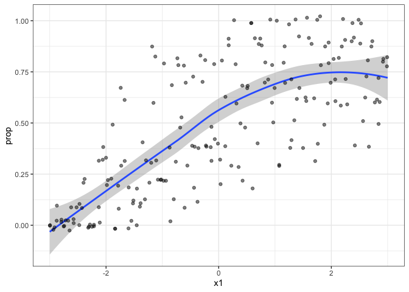
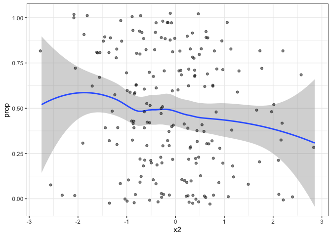
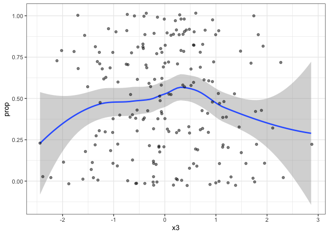
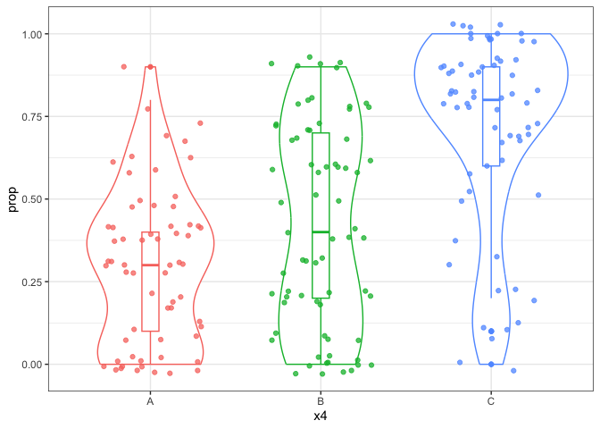
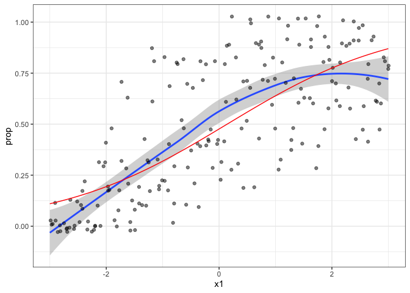
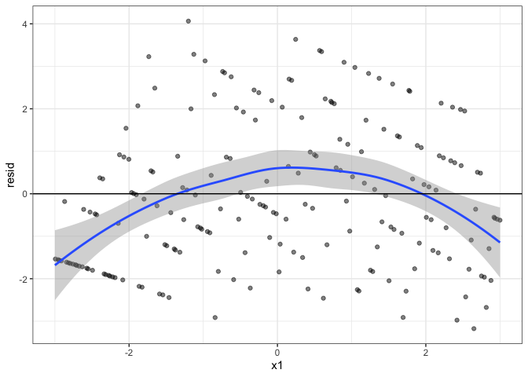

# Week Seven


## Last Week

- GLMs and Logistic Regression

- CODING! ( with the goal to understand model assumptions and specified
  functional relationship)

## This Week: More Generalized Linear Models

Video:

- Model fitting and intervals: IRLS + Wald (MLE) and MCMC (Bayes)

- Intrepreting model coefficients: curve fitting, probability, log odds
  / odds ratios.

Today:

- Activity:

  - Model checking and residuals
  - Model selection principles

- Thursday: Lab

  - Separation

## Next Week: Midterm Exam Week

- Tuesday: Review Day + Take Home

- Thursday: In class (1 page handwritten study sheet permitted)

------------------------------------------------------------------------



### Logistic Regression

Recall the logistic regression framework, which satisfies the three
elements of a GLM (random component, systematic component, link
function)

We can also simultaneously consider several different predictor, both
continuous and categorical. Additionally, we should also evaluate
whether `y ~ x1 + x2` is appropriate or whether interactions or
non-linear relationships are appropriate For example,

$$\pi  = logit^{-1}(\beta_0 + \beta_1 x_1 + \beta_2 x_2 + \beta_3 x_1 x_2)$$
or
$$\pi  = logit^{-1}(\beta_0 + \beta_1 x_1 + \beta_2 x_1^2 + \beta_3 I(x_2 = A) +  \beta_3 I(x_2 = B))$$

### Model Exploration Detective Work

I’ve created a synthetic dataset for you to explore. The goal is to try
and recover the true model. Note: that in practice we don’t know a “true
model.”

I’ve given you a synthetic dataset with 200 binomial trials, where each
binomial trial has 10 binary values.

``` r
secret_data <- read_csv('https://raw.githubusercontent.com/STAT439/Data/refs/heads/main/week7_data.csv')
```

    Rows: 200 Columns: 5
    ── Column specification ────────────────────────────────────────────────────────
    Delimiter: ","
    chr (1): x4
    dbl (4): y, x1, x2, x3

    ℹ Use `spec()` to retrieve the full column specification for this data.
    ℹ Specify the column types or set `show_col_types = FALSE` to quiet this message.

1.  Plot the response (success out of 10 trials) against each of the
    potential covariates.

``` r
secret_data |>
  mutate(prop = y / 10)|>
  ggplot(aes(y = prop, x = x1)) +
  geom_smooth(method = 'loess', formula = 'y ~ x') +
  geom_jitter(alpha = .5, height = .03, width = .03) +
  theme_bw()
```



``` r
secret_data |>
  mutate(prop = y / 10)|>
  ggplot(aes(y = prop, x = x2)) +
  geom_smooth(method = 'loess', formula = 'y ~ x') +
  geom_jitter(alpha = .5, height = .03, width = .03) +
  theme_bw()
```



``` r
secret_data |>
  mutate(prop = y / 10)|>
  ggplot(aes(y = prop, x = x3)) +
  geom_smooth(method = 'loess', formula = 'y ~ x') +
  geom_jitter(alpha = .5, height = .03, width = .03) +
  theme_bw()
```



``` r
secret_data |>
  mutate(prop = y / 10)|>
  ggplot(aes(y = prop, x = x4, color = x4)) +
  geom_smooth(method = 'loess', formula = 'y ~ x') +
  geom_violin() +
  geom_boxplot(width = .1) +
  geom_jitter(alpha = .75, height = .03, width = .3) +
  theme_bw() +
  theme(legend.position = 'none')
```



Discuss what you see.

2.  Let’s fit a start by fitting a simple logistic regression model
    `y ~ x1`

``` r
ml <- glm(cbind(y, 10-y) ~ x1, data = secret_data, family = binomial)
summary(ml)
```


    Call:
    glm(formula = cbind(y, 10 - y) ~ x1, family = binomial, data = secret_data)

    Coefficients:
                Estimate Std. Error z value Pr(>|z|)    
    (Intercept) -0.09470    0.05135  -1.844   0.0651 .  
    x1           0.66542    0.03330  19.980   <2e-16 ***
    ---
    Signif. codes:  0 '***' 0.001 '**' 0.01 '*' 0.05 '.' 0.1 ' ' 1

    (Dispersion parameter for binomial family taken to be 1)

        Null deviance: 1065.23  on 199  degrees of freedom
    Residual deviance:  548.97  on 198  degrees of freedom
    AIC: 940.68

    Number of Fisher Scoring iterations: 4

``` r
confint(ml)
```

    Waiting for profiling to be done...

                     2.5 %      97.5 %
    (Intercept) -0.1955051 0.005849738
    x1           0.6010787 0.731683811

Now add this model fit to your previous figure.

``` r
fit_data <- tibble(x1 = secret_data$x1, y = secret_data$y, prop = invlogit(coef(ml)[[1]] + coef(ml)[[2]] * x1))
secret_data |>
  mutate(prop = y / 10)|>
  ggplot(aes(y = prop, x = x1)) +
  geom_smooth(method = 'loess', formula = 'y ~ x') +
  geom_jitter(alpha = .5, height = .03, width = .03) +
  theme_bw() +
  geom_line(data = fit_data, color = 'red')
```



Let’s also look directly at a type of residual (the standardized
residual), which can be computed with `rstandard()`.

``` r
tibble(x1 = secret_data$x1, resid = rstandard(ml)) |>
  ggplot(aes(y = resid, x = x1)) +
  geom_jitter(alpha = .5) +
  geom_smooth(method = 'loess', formula = 'y ~ x') +
  theme_bw() +
  geom_hline(yintercept = 0)
```



### Let’s also consider x4

- Create an EDA that contains both x1 and x4, this should echo the model
  we will be fitting.

- Add x4 to the model

- Plot fit

### Which model is better?

One option is to use some sort of information criteria

- AIC = -2 $\times$ (log likelihood - \# parameters)
- we can do something similar, in spirit, with Bayesian approaches
  (Thursday Lab)

### Continue your model exploration and choose the best model you can find by AIC that also gives reasonable residuals
