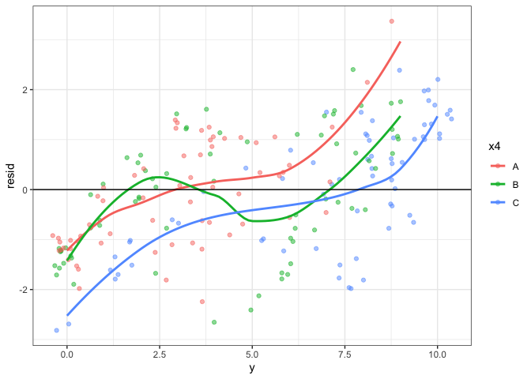

# Week Seven

## Last Week

- GLMs and Logistic Regression

- CODING! ( with the goal to understand model assumptions and specified
  functional relationship)

## This Week: More Generalized Linear Models

Video:

- Model fitting and intervals: IRLS + Wald (MLE) and MCMC (Bayes)

- Intrepreting model coefficients: curve fitting, probability, log odds
  / odds ratios.

Today:

- Activity:

  - Model checking and residuals
  - Model selection principles

- Thursday: Lab

  - Separation

## Next Week: Midterm Exam Week

- Tuesday: Review Day + Take Home

- Thursday: In class (1 page handwritten study sheet permitted)

------------------------------------------------------------------------



### Logistic Regression

Recall the logistic regression framework, which satisfies the three
elements of a GLM (random component, systematic component, link
function)

We can also simultaneously consider several different predictor, both
continuous and categorical. Additionally, we should also evaluate
whether `y ~ x1 + x2` is appropriate or whether interactions or
non-linear relationships are appropriate For example,

$$\pi  = logit^{-1}(\beta_0 + \beta_1 x_1 + \beta_2 x_2 + \beta_3 x_1 x_2)$$
or
$$\pi  = logit^{-1}(\beta_0 + \beta_1 x_1 + \beta_2 x_1^2 + \beta_3 I(x_2 = A) +  \beta_3 I(x_2 = B))$$

### Model Exploration Detective Work

I’ve created a synthetic dataset for you to explore. The goal is to try
and recover the true model. Note: that in practice we don’t know a “true
model.”

I’ve given you a synthetic dataset with 200 binomial trials, where each
binomial trial has 10 binary values.

``` r
secret_data <- read_csv('https://raw.githubusercontent.com/STAT439/Data/refs/heads/main/week7_data.csv')
```

    Rows: 200 Columns: 5
    ── Column specification ────────────────────────────────────────────────────────
    Delimiter: ","
    chr (1): x4
    dbl (4): y, x1, x2, x3

    ℹ Use `spec()` to retrieve the full column specification for this data.
    ℹ Specify the column types or set `show_col_types = FALSE` to quiet this message.

1.  Plot the response (success out of 10 trials) against each of the
    potential covariates.

``` r
secret_data |>
  mutate(prop = y / 10)|>
  ggplot(aes(y = prop, x = x1)) +
  geom_smooth(method = 'loess', formula = 'y ~ x') +
  geom_jitter(alpha = .5, height = .03, width = .03) +
  theme_bw()
```


``` r
secret_data |>
  mutate(prop = y / 10)|>
  ggplot(aes(y = prop, x = x2)) +
  geom_smooth(method = 'loess', formula = 'y ~ x') +
  geom_jitter(alpha = .5, height = .03, width = .03) +
  theme_bw()
```


``` r
secret_data |>
  mutate(prop = y / 10)|>
  ggplot(aes(y = prop, x = x3)) +
  geom_smooth(method = 'loess', formula = 'y ~ x') +
  geom_jitter(alpha = .5, height = .03, width = .03) +
  theme_bw()
```


``` r
secret_data |>
  mutate(prop = y / 10)|>
  ggplot(aes(y = prop, x = x4, color = x4)) +
 # geom_smooth(method = 'loess', formula = 'y ~ x') +
  geom_violin() +
  geom_boxplot(width = .1) +
  geom_jitter(alpha = .75, height = .03, width = .3) +
  theme_bw() +
  theme(legend.position = 'none')
```


Discuss what you see.

2.  Let’s fit a start by fitting a simple logistic regression model
    `y ~ x1`

``` r
ml <- glm(cbind(y, 10-y) ~ x1, data = secret_data, family = binomial)
summary(ml)
```


    Call:
    glm(formula = cbind(y, 10 - y) ~ x1, family = binomial, data = secret_data)

    Coefficients:
                Estimate Std. Error z value Pr(>|z|)    
    (Intercept) -0.09470    0.05135  -1.844   0.0651 .  
    x1           0.66542    0.03330  19.980   <2e-16 ***
    ---
    Signif. codes:  0 '***' 0.001 '**' 0.01 '*' 0.05 '.' 0.1 ' ' 1

    (Dispersion parameter for binomial family taken to be 1)

        Null deviance: 1065.23  on 199  degrees of freedom
    Residual deviance:  548.97  on 198  degrees of freedom
    AIC: 940.68

    Number of Fisher Scoring iterations: 4

``` r
confint(ml)
```

    Waiting for profiling to be done...

                     2.5 %      97.5 %
    (Intercept) -0.1955051 0.005849738
    x1           0.6010787 0.731683811

Now add this model fit to your previous figure.

``` r
fit_data <- tibble(x1 = secret_data$x1, y = secret_data$y, prop = invlogit(coef(ml)[[1]] + coef(ml)[[2]] * x1))
secret_data |>
  mutate(prop = y / 10)|>
  ggplot(aes(y = prop, x = x1)) +
  geom_smooth(method = 'loess', formula = 'y ~ x') +
  geom_jitter(alpha = .5, height = .03, width = .03) +
  theme_bw() +
  geom_line(data = fit_data, color = 'red')
```


Let’s also look directly at a type of residual (the standardized
residual), which can be computed with `rstandard()`.

``` r
tibble(x1 = secret_data$x1, resid = rstandard(ml)) |>
  ggplot(aes(y = resid, x = x1)) +
  geom_jitter(alpha = .5) +
  geom_smooth(method = 'loess', formula = 'y ~ x') +
  theme_bw() +
  geom_hline(yintercept = 0)
```


### Let’s also consider x4

- Create an EDA that contains both x1 and x4, this should echo the model
  we will be fitting.

``` r
secret_data |>
  mutate(prop = y / 10)|>
  ggplot(aes(y = prop, x = x1, color = x4)) +
  geom_smooth(method = 'loess', formula = 'y ~ x', se = F) +
  geom_jitter(alpha = .5, height = .03, width = .03) +
  theme_bw()
```


- Add x4 to the model

``` r
ml2 <- glm(cbind(y, 10-y) ~ x1 + x4 , data = secret_data, family = binomial)
summary(ml2)
```


    Call:
    glm(formula = cbind(y, 10 - y) ~ x1 + x4, family = binomial, 
        data = secret_data)

    Coefficients:
                Estimate Std. Error z value Pr(>|z|)    
    (Intercept) -0.93630    0.09743  -9.610  < 2e-16 ***
    x1           0.73778    0.03698  19.950  < 2e-16 ***
    x4B          0.43440    0.13444   3.231  0.00123 ** 
    x4C          2.05812    0.14192  14.502  < 2e-16 ***
    ---
    Signif. codes:  0 '***' 0.001 '**' 0.01 '*' 0.05 '.' 0.1 ' ' 1

    (Dispersion parameter for binomial family taken to be 1)

        Null deviance: 1065.23  on 199  degrees of freedom
    Residual deviance:  284.43  on 196  degrees of freedom
    AIC: 680.14

    Number of Fisher Scoring iterations: 4

``` r
confint(ml2)
```

    Waiting for profiling to be done...

                     2.5 %     97.5 %
    (Intercept) -1.1293646 -0.7472270
    x1           0.6664940  0.8115276
    x4B          0.1713468  0.6986176
    x4C          1.7828710  2.3394098

- Plot fit

``` r
fit_data <- tibble(x = rep(secret_data$x1,3), 
                   y = rep(secret_data$y,3), 
                   prop = c(invlogit( coef(ml2)[[1]] * secret_data$x1 + coef(ml2)[2]),
                            invlogit( coef(ml2)[[1]] * secret_data$x1 + coef(ml2)[3]),
                            invlogit( coef(ml2)[[1]] * secret_data$x1 + coef(ml2)[4])),
                   x4 = rep(c('A','B','C'), each = nrow(secret_data))) 


secret_data |>
  mutate(prop = y / 10)|>
  ggplot(aes(y = prop, x = x1, color = x4)) +
  geom_smooth(method = 'loess', formula = 'y ~ x', se = F) +
  geom_jitter(alpha = .5, height = .03, width = .03) +
  theme_bw() +
  geom_line(data = fit_data |> rename(x1 = x),
            linetype = 2)
```


``` r
tibble(x1 = secret_data$x1, resid = rstandard(ml2), x4 = secret_data$x4) |>
  ggplot(aes(y = resid, x = x1, color = x4)) +
  geom_jitter(alpha = .5) +
  geom_smooth(method = 'loess', formula = 'y ~ x', se = F) +
  theme_bw() +
  geom_hline(yintercept = 0)
```


``` r
tibble(y= secret_data$y, resid = rstandard(ml2), x4 = secret_data$x4) |>
  ggplot(aes(y = resid, x = y, color = x4)) +
  geom_jitter(alpha = .5) +
  geom_smooth(method = 'loess', formula = 'y ~ x', se = F) +
  theme_bw() +
  geom_hline(yintercept = 0)
```



### Which model is better?

One option is to use some sort of information criteria

- AIC = -2 $\times$ (log likelihood - \# parameters)
- we can do something similar, in spirit, with Bayesian approaches
  (Thursday Lab)

``` r
AIC(ml)
```

    [1] 940.676

``` r
AIC(ml2)
```

    [1] 680.1368

### Continue your model exploration and choose the best model you can find by AIC that also gives reasonable residuals

``` r
ml3 <- glm(cbind(y, 10-y) ~  x1 + I(x1^2) + x4 - 1, data = secret_data, family = binomial)
summary(ml3)
```


    Call:
    glm(formula = cbind(y, 10 - y) ~ x1 + I(x1^2) + x4 - 1, family = binomial, 
        data = secret_data)

    Coefficients:
            Estimate Std. Error z value Pr(>|z|)    
    x1       0.81557    0.04149  19.656  < 2e-16 ***
    I(x1^2) -0.21706    0.02533  -8.568  < 2e-16 ***
    x4A     -0.60745    0.10307  -5.894 3.78e-09 ***
    x4B      0.15155    0.12041   1.259    0.208    
    x4C      1.69750    0.12900  13.159  < 2e-16 ***
    ---
    Signif. codes:  0 '***' 0.001 '**' 0.01 '*' 0.05 '.' 0.1 ' ' 1

    (Dispersion parameter for binomial family taken to be 1)

        Null deviance: 1067.83  on 200  degrees of freedom
    Residual deviance:  204.33  on 195  degrees of freedom
    AIC: 602.04

    Number of Fisher Scoring iterations: 4

``` r
confint(ml3)
```

    Waiting for profiling to be done...

                 2.5 %     97.5 %
    x1       0.7360038  0.8987736
    I(x1^2) -0.2673514 -0.1679786
    x4A     -0.8110833 -0.4068172
    x4B     -0.0845206  0.3878003
    x4C      1.4496633  1.9557877

``` r
AIC(ml3)
```

    [1] 602.036

``` r
fit_data <- tibble(x = rep(secret_data$x1,3), 
                   y = rep(secret_data$y,3), 
                   prop = c(invlogit( coef(ml3)[[1]] * secret_data$x1 + coef(ml3)[[2]] * secret_data$x1^2 + coef(ml3)[3]),
                            invlogit( coef(ml3)[[1]] * secret_data$x1 + coef(ml3)[[2]] * secret_data$x1^2 + coef(ml3)[4]),
                            invlogit( coef(ml3)[[1]] * secret_data$x1 + coef(ml3)[[2]] * secret_data$x1^2 + coef(ml3)[5])),
                   x4 = rep(c('A','B','C'), each = nrow(secret_data))) 


secret_data |>
  mutate(prop = y / 10)|>
  ggplot(aes(y = prop, x = x1, color = x4)) +
  geom_smooth(method = 'loess', formula = 'y ~ x', se = F) +
  geom_jitter(alpha = .5, height = .03, width = .03) +
  theme_bw() +
  geom_line(data = fit_data |> rename(x1 = x),
            linetype = 2)
```


``` r
tibble(x1 = secret_data$x1, resid = rstandard(ml3), x4 = secret_data$x4) |>
  ggplot(aes(y = resid, x = x1, color = x4)) +
  geom_jitter(alpha = .5) +
  geom_smooth(method = 'loess', formula = 'y ~ x', se = F) +
  theme_bw() +
  geom_hline(yintercept = 0)
```


``` r
ml4 <- glm(cbind(y, 10-y) ~  x1 + x2 + I(x1^2) + x4 - 1, data = secret_data, family = binomial)
summary(ml4)
```


    Call:
    glm(formula = cbind(y, 10 - y) ~ x1 + x2 + I(x1^2) + x4 - 1, 
        family = binomial, data = secret_data)

    Coefficients:
            Estimate Std. Error z value Pr(>|z|)    
    x1       0.81280    0.04144  19.612  < 2e-16 ***
    x2      -0.08858    0.05558  -1.594    0.111    
    I(x1^2) -0.21545    0.02534  -8.504  < 2e-16 ***
    x4A     -0.59767    0.10317  -5.793 6.91e-09 ***
    x4B      0.13818    0.12066   1.145    0.252    
    x4C      1.67875    0.12991  12.922  < 2e-16 ***
    ---
    Signif. codes:  0 '***' 0.001 '**' 0.01 '*' 0.05 '.' 0.1 ' ' 1

    (Dispersion parameter for binomial family taken to be 1)

        Null deviance: 1067.83  on 200  degrees of freedom
    Residual deviance:  201.78  on 194  degrees of freedom
    AIC: 601.49

    Number of Fisher Scoring iterations: 4

``` r
confint(ml4)
```

    Waiting for profiling to be done...

                  2.5 %      97.5 %
    x1       0.73333122  0.89591337
    x2      -0.19774007  0.02025164
    I(x1^2) -0.26573904 -0.16636129
    x4A     -0.80149855 -0.39683685
    x4B     -0.09843048  0.37490973
    x4C      1.42903377  1.93872439

``` r
AIC(ml4)
```

    [1] 601.4916

``` r
ml5 <- glm(cbind(y, 10-y) ~  x1 + x3 + I(x1^2) + x4 - 1, data = secret_data, family = binomial)
summary(ml4)
```


    Call:
    glm(formula = cbind(y, 10 - y) ~ x1 + x2 + I(x1^2) + x4 - 1, 
        family = binomial, data = secret_data)

    Coefficients:
            Estimate Std. Error z value Pr(>|z|)    
    x1       0.81280    0.04144  19.612  < 2e-16 ***
    x2      -0.08858    0.05558  -1.594    0.111    
    I(x1^2) -0.21545    0.02534  -8.504  < 2e-16 ***
    x4A     -0.59767    0.10317  -5.793 6.91e-09 ***
    x4B      0.13818    0.12066   1.145    0.252    
    x4C      1.67875    0.12991  12.922  < 2e-16 ***
    ---
    Signif. codes:  0 '***' 0.001 '**' 0.01 '*' 0.05 '.' 0.1 ' ' 1

    (Dispersion parameter for binomial family taken to be 1)

        Null deviance: 1067.83  on 200  degrees of freedom
    Residual deviance:  201.78  on 194  degrees of freedom
    AIC: 601.49

    Number of Fisher Scoring iterations: 4

``` r
confint(ml4)
```

    Waiting for profiling to be done...

                  2.5 %      97.5 %
    x1       0.73333122  0.89591337
    x2      -0.19774007  0.02025164
    I(x1^2) -0.26573904 -0.16636129
    x4A     -0.80149855 -0.39683685
    x4B     -0.09843048  0.37490973
    x4C      1.42903377  1.93872439

``` r
AIC(ml4)
```

    [1] 601.4916
